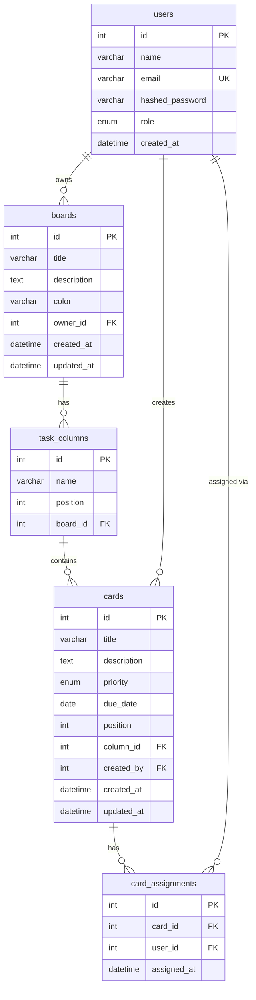

# Database Design — TaskFlow

## Overview

TaskFlow uses a relational MySQL database with five core tables. The design prioritizes simplicity and correctness over premature optimization — straightforward foreign keys and cascade deletes keep data consistent without complex application-level logic.

---

## ER Diagram

---

## Table Descriptions

### `users`
Stores all user accounts. Passwords are bcrypt-hashed — never stored in plaintext.

| Column | Type | Notes |
|---|---|---|
| `id` | INT, PK | Auto-increment |
| `name` | VARCHAR(100) | Display name |
| `email` | VARCHAR(150), UNIQUE | Login identifier |
| `hashed_password` | VARCHAR(255) | bcrypt hash |
| `role` | ENUM('admin','member') | Default: member |
| `created_at` | DATETIME | Server timestamp |

---

### `boards`
A workspace container for Kanban columns. Each board is owned by one user.

| Column | Type | Notes |
|---|---|---|
| `id` | INT, PK | — |
| `title` | VARCHAR(200) | Board name |
| `description` | TEXT | Optional |
| `color` | VARCHAR(7) | Hex color, e.g. `#6366f1` |
| `owner_id` | INT, FK → users.id | CASCADE DELETE |
| `created_at` | DATETIME | — |
| `updated_at` | DATETIME | Auto on update |

---

### `task_columns`
Represents columns (swimlanes) within a board. Initially seeded with To Do / In Progress / Done.

| Column | Type | Notes |
|---|---|---|
| `id` | INT, PK | — |
| `name` | VARCHAR(100) | Column label |
| `position` | INT | Ordering index (0-based) |
| `board_id` | INT, FK → boards.id | CASCADE DELETE |

---

### `cards`
Individual task items. Can hold a title, description, priority, due date, and position within a column.

| Column | Type | Notes |
|---|---|---|
| `id` | INT, PK | — |
| `title` | VARCHAR(255) | Required |
| `description` | TEXT | Optional detail |
| `priority` | ENUM('low','medium','high') | Default: medium |
| `due_date` | DATE | Optional |
| `position` | INT | Order within column |
| `column_id` | INT, FK → task_columns.id | CASCADE DELETE |
| `created_by` | INT, FK → users.id | Creator reference |
| `created_at` | DATETIME | — |
| `updated_at` | DATETIME | Auto on update |

---

### `card_assignments`
Many-to-many join between cards and users. A card can have multiple assignees.

| Column | Type | Notes |
|---|---|---|
| `id` | INT, PK | — |
| `card_id` | INT, FK → cards.id | CASCADE DELETE |
| `user_id` | INT, FK → users.id | CASCADE DELETE |
| `assigned_at` | DATETIME | When assigned |

---

## Relationships Summary

| Relationship | Type |
|---|---|
| User → Boards | One-to-Many |
| Board → Columns | One-to-Many |
| Column → Cards | One-to-Many |
| Card → Assignments | One-to-Many |
| User → Assignments | One-to-Many |
| Card ↔ User (via assignments) | Many-to-Many |

---

## Design Decisions

**Why separate `task_columns` instead of an enum on cards?**
Columns need to be reorderable and optionally customizable. Storing them in a table allows position tracking and future custom column support without schema changes.

**Why use an INT position column instead of timestamps for ordering?**
Position is explicit and easy to reorder. Timestamp-based ordering breaks when cards are created rapidly.

**Why `card_assignments` as a separate table?**
Cards can be assigned to multiple people. A many-to-many join table is the normalized approach and avoids JSON arrays in card columns.

**Why CASCADE DELETE on all foreign keys?**
Deleting a board should clean up all its columns and cards. Orphaned data causes inconsistencies and bloats the database over time.
